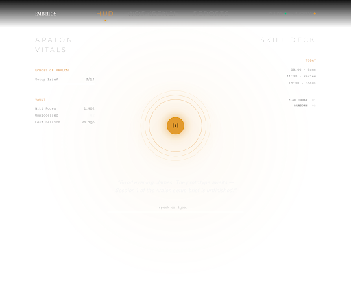

# Ember OS Dashboard

A **local-first "Jarvis layer" for an Obsidian vault**: a voice-driven HUD, one-click headless Claude Code skill runs, an approval-gated agent workbench for local LM Studio models (with skills + MCP), and archival reading rooms over your markdown — all served from one Node process on your machine.



The vault stays the single source of truth: the dashboard **reads and writes markdown, and nothing else owns data**. Voice is fully local (faster-whisper in, Kokoro out — no cloud audio, ever).

> **How this fits together:** this is the dashboard from my article
> [*I Built an AI Operating System in Obsidian So My Game Dev Hours Actually Count*](https://ktmarine1999.medium.com/i-built-an-ai-operating-system-in-obsidian-so-my-game-dev-hours-actually-count-441c2ce19606).
> The Workbench's core pattern has a standalone tutorial + minimal repo: [*Your Local LLM Can Use Tools Too*](https://medium.com/@ktmarine1999/a80ef1b4ab44) / [LMStudioWorkBench](https://github.com/JamesLaFritz/LMStudioWorkBench).

## Pages

- **HUD** (`/`) — push-to-talk voice orb (hold Space; barge-in interrupts Ember mid-sentence), a Jarvis router (regex intents → local model for the rest), a skill deck that fires headless Claude Code runs (per-skill model tier: haiku/sonnet/opus), vault vitals rails (project progress, open loops, writing cadence, news wire), and chunked text-to-speech that reads whole documents with a Stop toggle.
- **Workbench** (`/workbench.html`) — a Claude-Code-style agent on **local LM Studio models**: model load/unload with GPU readout, allowlisted workspaces, session persistence with per-session token/tok-s stats, reasoning collapsibles for `<think>` models, and swappable presets (coding agent, vault librarian, design brainstorm, researcher). Tools: `read_file · list_dir · grep · glob · use_skill` (free) and `write_file · edit_file · run_command` (approval cards with diffs; deny feeds back; "always allow" builds a per-session allowlist; Plan mode is read-only, Auto skips gates). **Skills** load from the workspace's `.claude/skills/` with Claude-style progressive disclosure, and **MCP servers** are read from your own `~/.claude.json` — one registry for Claude Code and the local agent, every MCP call behind the same approval gate.
- **Reports / Research / Wiki** (`/reports.html`, `/research.html`, `/wiki.html`) — museum-style reading rooms over vault folders: grouped archives, rendered markdown, section TOC, Open-in-Obsidian, Copy, and Speak-this-document.

## Architecture

```
Mic → faster-whisper (local) → regex router ─┬→ local LM Studio model (chat / rundown)
                                             └→ headless `claude -p` skill run → report written into the vault
Vault (markdown + indexes) ← the single source of truth → dashboard renders & triggers, never owns data
Workbench: browser ⇄ WS ⇄ agent loop ⇄ LM Studio /v1 ⇄ tools in a workspace jail (+ skills, + MCP via stdio)
Kokoro (local) ← chunked TTS ← replies, reports, articles
```

## Requirements

- **Node 18+** (`express`, `ws` are the only runtime deps)
- **[LM Studio](https://lmstudio.ai)** with the local server on (`lms server start`) and at least one tool-calling model (Qwen-class recommended; the workbench was built on a 24 GB RTX 4090)
- **Python 3.11+** for the optional voice sidecar (faster-whisper + kokoro-onnx; models fetched by `voice-sidecar/setup.ps1`) — the dashboard degrades gracefully without it
- **[Claude Code](https://claude.com/claude-code)** CLI for the skill deck's headless runs — optional; the local workbench works without it
- `nvidia-smi` for the GPU readout — optional

## Setup

```bash
git clone https://github.com/JamesLaFritz/ember-dashboard.git
cd ember-dashboard
npm install
cp config.example.json config.json    # then edit: vault path, workspaces, skills
node server.js                        # → http://localhost:4517
```

Voice (optional):

```powershell
cd voice-sidecar
./setup.ps1        # venv + deps + downloads kokoro model files (~340 MB, local only)
./run.ps1          # FastAPI sidecar on :4518
```

### `config.json` keys

| Key | What it is |
|---|---|
| `vaultPath` / `vaultName` | Your Obsidian vault root and its name (for `obsidian://` links) |
| `lmStudioUrl` | OpenAI-compatible server base (LM Studio default `:1234`) |
| `routerModel` | Local model the HUD router uses for chat/rundowns |
| `claudeCommand` / `claudeHeadlessAllow` | Claude CLI binary + tools pre-allowed for headless skill runs (non-interactive runs silently deny everything else) |
| `workspaces` | Allowlisted roots the workbench agent may operate in |
| `skills` | The skill deck: vault skill ids + per-skill Claude model tier |

The vault itself isn't in this repo — the dashboard works over any vault that follows the structure described in the article (`Raw → Wiki → Projects` with indexes, skills in `.claude/skills/`).

## Security posture

The workbench executes model-chosen file writes and shell commands **on your machine, behind approval cards** — read the card, especially for `run_command`. Workspaces are jailed (every model-supplied path is resolved and checked), MCP and write tools never run un-gated outside Auto mode, and session transcripts stay in the gitignored `.sessions/`. Treat Auto mode as what it is: you, pre-approving everything.

## Credits & provenance

The OS pattern is distilled from talks by **Chase AI**, **Simon Scrapes**, **Ben Fellows**, and **Andrej Karpathy's** knowledge-structure pattern (full references in the article). The dashboard itself was **built with Claude (Fable 5) in the Claude Code terminal** — pair-designed, AI-written, human-approved and live-tested feature by feature. Design system: my Ember Heritage tokens via Google Stitch.

## License

MIT
