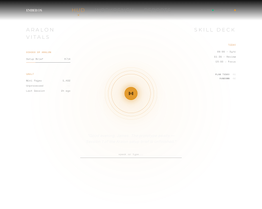

# Ember OS Dashboard

A **local-first "Jarvis layer" for an Obsidian vault**: a voice-driven HUD, one-click headless Claude Code skill runs, an approval-gated agent workbench for local LM Studio models (with skills + MCP), and archival reading rooms over your markdown — all served from one Node process on your machine.



The vault stays the single source of truth: the dashboard **reads and writes markdown, and nothing else owns data**. Voice is fully local (faster-whisper in, Kokoro out — no cloud audio, ever).

> **How this fits together:** this is the dashboard from my article
> [*I Built an AI Operating System in Obsidian So My Game Dev Hours Actually Count*](https://ktmarine1999.medium.com/i-built-an-ai-operating-system-in-obsidian-so-my-game-dev-hours-actually-count-441c2ce19606).
> The Workbench's core pattern has a standalone tutorial + minimal repo: [*Your Local LLM Can Use Tools Too*](https://medium.com/@ktmarine1999/a80ef1b4ab44) / [LMStudioWorkBench](https://github.com/JamesLaFritz/LMStudioWorkBench).

## Pages

- **HUD** (`/`) — push-to-talk voice orb (hold Space; barge-in interrupts Ember mid-sentence), a Jarvis router (regex intents → local model for the rest), a skill deck that fires headless Claude Code runs (per-skill model tier: haiku/sonnet/opus), vault vitals rails (project progress, open loops, writing cadence, news wire), and chunked text-to-speech that reads whole documents with a Stop toggle.
- **Workbench** (`/workbench.html`) — a Claude-Code-style agent on **local LM Studio models**: model load/unload with GPU readout, allowlisted workspaces, session persistence with per-session token/tok-s stats, reasoning collapsibles for `<think>` models, and swappable presets (coding agent, vault librarian, design brainstorm, researcher). Tools: `read_file · list_dir · grep · glob · use_skill` (free) and `write_file · edit_file · run_command` (approval cards with diffs; deny feeds back; "always allow" builds a per-session allowlist; Plan mode is read-only, Auto skips gates). **Skills** load from the workspace's `.claude/skills/` with Claude-style progressive disclosure, and **MCP servers** are read from your own `~/.claude.json` — one registry for Claude Code and the local agent, every MCP call behind the same approval gate.
- **Reports / Research / Wiki** (`/reports.html`, `/research.html`, `/wiki.html`) — museum-style reading rooms over vault folders: grouped archives, rendered markdown, section TOC, Open-in-Obsidian, Copy, and Speak-this-document.

## Architecture

```
Mic → faster-whisper (local) → regex router ─┬→ local LM Studio model (chat / rundown)
                                             └→ headless `claude -p` skill run → report written into the vault
Vault (markdown + indexes) ← the single source of truth → dashboard renders & triggers, never owns data
Workbench: browser ⇄ WS ⇄ agent loop ⇄ LM Studio /v1 ⇄ tools in a workspace jail (+ skills, + MCP via stdio)
Kokoro (local) ← chunked TTS ← replies, reports, articles
```

## Requirements

- **Node 18+** (`express`, `ws` are the only runtime deps)
- **[LM Studio](https://lmstudio.ai)** with the local server on (`lms server start`) and at least one tool-calling model (Qwen-class recommended; the workbench was built on a 24 GB RTX 4090)
- **Python 3.11+** for the optional voice sidecar (faster-whisper + kokoro-onnx; models fetched by `voice-sidecar/setup.ps1`) — the dashboard degrades gracefully without it
- **[Claude Code](https://claude.com/claude-code)** CLI for the skill deck's headless runs — optional; the local workbench works without it
- `nvidia-smi` for the GPU readout — optional

## Setup

```bash
git clone https://github.com/JamesLaFritz/ember-dashboard.git
cd ember-dashboard
npm install
cp config.example.json config.json    # then edit: vault path, workspaces, skills
node server.js                        # → http://localhost:4517
```

Voice (optional):

```powershell
cd voice-sidecar
./setup.ps1        # venv + deps + downloads kokoro model files (~340 MB, local only)
./run.ps1          # FastAPI sidecar on :4518
```

### `config.json` keys

| Key | What it is |
|---|---|
| `vaultPath` / `vaultName` | Your Obsidian vault root and its name (for `obsidian://` links) |
| `lmStudioUrl` | OpenAI-compatible server base (LM Studio default `:1234`) |
| `routerModel` | Local model the HUD router uses for chat/rundowns |
| `claudeCommand` / `claudeHeadlessAllow` | Claude CLI binary + tools pre-allowed for headless skill runs (non-interactive runs silently deny everything else) |
| `workspaces` | Allowlisted roots the workbench agent may operate in |
| `vitals` | What the left rail tracks — see below |
| `skills` | The skill deck: vault skill ids + per-skill Claude model tier |

The `vitals` block is what makes the HUD *yours*. Folder conventions (`Wiki/`, `Raw/`, `Daily/`, `System/Memory/`) are the vault contract and stay fixed; the personal parts are configured:

```json
"vitals": {
  "project": {
    "label":  "Your Project",
    "note":   "Projects/Your Project/Your Project.md",
    "brief":  "Projects/Your Project/BRIEF.md",
    "devlog": "Projects/Your Project/Devlog"
  },
  "articles":     { "folder": "Projects/Articles", "monthlyTarget": 2 },
  "newsSections": ["AI", "Unity", "Unreal"]
}
```

`project` drives the brief progress bar, open-loop count, and days-since-devlog. `newSections` are the headings pulled from the newest `System/Memory/Reports/*Trends*.md` — change them and the news wire follows. Omit the whole block and the project card degrades to `—` rather than breaking.

The vault itself isn't in this repo — the dashboard works over any vault that follows the structure described in the article (`Raw → Wiki → Projects` with indexes, skills in `.claude/skills/`).

### Making the agent yours — `identity/`

The workbench agent's personality and its picture of who it works for live in two editable markdown files, not in code:

| File | What it is |
|---|---|
| `identity/SOUL.md` | Who the agent is — voice, standards, what it never does |
| `identity/USER.md` | Who it works for — your stack, how you like to work, what needs confirming |

Presets (Coding Agent, Vault Librarian, Researcher, Design Brainstorm) supply only the **role** for a session; identity is layered underneath. Edit the files and the next session picks them up — no restart.

| Env var | Effect |
|---|---|
| `EMBER_SOUL_PATH` / `EMBER_USER_PATH` | Point at files you already maintain (e.g. your vault's own SOUL/USER notes) |
| `EMBER_IDENTITY_DIR` | Use a different directory containing `SOUL.md` and `USER.md` |
| `EMBER_IDENTITY=off` | No identity layer — role instructions only |

`identity/USER.md` ships as a **template with placeholders**. Either fill it in locally or, better for a public fork, keep your real profile outside the repo and point `EMBER_USER_PATH` at it.

Both files are re-sent on every turn, so length is context you don't get back — each is truncated at 8,000 chars with a visible marker. On a 32k-context local model, a 4,000-char pair costs roughly 3% of the window per turn.

> **Benchmarking:** use `EMBER_IDENTITY=off`. An identity file is part of the prompt, so comparing models under different identities compares prompts, not models. The session snapshot records which SOUL/USER files a run used.

### Project instructions — `AGENTS.md`

The agent reads an `AGENTS.md` at the **workspace root** if one exists; otherwise it falls back to the workbench's own `AGENTS.md`. A workspace file **replaces** the default rather than adding to it — project rules are supposed to win. Override the fallback with `EMBER_AGENTS_PATH`.

`CRAFT.md` at the repo root is the long-form working method (~14.5k chars ≈ 3.6k tokens per turn). It is **off by default** and referenced from `AGENTS.md`; set `EMBER_CRAFT=on` to inject it when the work is hard enough to be worth the budget. The shipped copy is generic on purpose — point `EMBER_CRAFT_PATH` at your own method document if you keep one, since its examples will be worth more than these.

System prompt order is identity → method → project rules → session role, most specific last.

### Workbench memory

The agent has a `remember` tool taking `kind: "lesson" | "decision"` and one line of text. Entries are **scoped per workspace**, stored under `.sessions/memory/` (never inside your project), and injected into every future session on that workspace — the most recent 40, decisions before lessons.

| Action | What happens |
|---|---|
| **Compaction** | Writes a session log to `.sessions/logs/<timestamp>-<id>.md` — the handoff summary, token counts, turns folded, and anything `remember`ed. Compaction is the moment history stops being recoverable from context, so that is when a durable record is worth writing |
| **Clear** | Archives the whole transcript to `.sessions/archive/<timestamp>-<id>.json`, then resets the conversation. The session survives — same id, model, workspace, preset, approvals, MCP servers. If the archive write fails, the clear is refused rather than losing the transcript |
| **Delete** | Removes the session entirely. Use Clear when you want a fresh context but the same setup |

Archives are listable at `GET /api/agent/archives` and `GET /api/agent/:id/archives`.

### Generation bounds

Omitting `max_tokens` leaves LM Studio unbounded, so a prompt asking for output "as long as possible" is answered literally — a measured run was still streaming at 500 s and 88,650 characters with no end in sight, and the turn produced nothing usable.

| Env var | Default | What it does |
|---|---|---|
| `EMBER_MAX_TOKENS` | `32768` | Output ceiling per model call — see below |
| `EMBER_STREAM_IDLE_MS` | `120000` | Abort if no token arrives for this long. Bounds the gap *between* tokens, not the total run, so a legitimately long generation is never cut off for being long |
| `EMBER_MAX_AUTO_CONTINUE` | `3` | How many times a truncated reply is resumed automatically. `0` restores the manual "type continue yourself" behaviour |

### Harness settings — `config.json`

Every tuning knob lives in the `harness` block of `config.json`, which is where a benchmark record can cite it and version control can see it drift. An environment variable of the same name still wins, for a one-off run:

```
EMBER_MAX_HOPS=400 node server.js
```

| `config.json` key | Env override | Default | What it does |
|---|---|---|---|
| `maxHops` | `EMBER_MAX_HOPS` | `250` | Tool hops in one turn before the harness bails |
| `commandTimeoutMs` | `EMBER_CMD_TIMEOUT_MS` | `600000` | `run_command` timeout |
| `maxOutputTokens` | `EMBER_MAX_TOKENS` | `16384` | Output ceiling per model call |
| `maxAutoContinue` | `EMBER_MAX_AUTO_CONTINUE` | `3` | Automatic resumes after a truncation |
| `streamIdleMs` | `EMBER_STREAM_IDLE_MS` | `120000` | Silence allowed before a tool call opens |
| `toolIdleMs` | `EMBER_TOOL_IDLE_MS` | `600000` | Silence allowed while a tool payload is generated |
| `shell` | `EMBER_SHELL` | auto | Shell for `run_command` (Git Bash preferred on Windows) |
| `identity` | `EMBER_IDENTITY` | `true` | Whether new sessions start with SOUL/USER |
| `identityDir` · `soulPath` · `userPath` | `EMBER_IDENTITY_DIR` · `EMBER_SOUL_PATH` · `EMBER_USER_PATH` | — | Where the identity files live |
| `agentsPath` | `EMBER_AGENTS_PATH` | — | Fallback `AGENTS.md` |
| `craft` · `craftPath` | `EMBER_CRAFT` · `EMBER_CRAFT_PATH` | `false` | The long-form method document |
| `maxToolCallsPerTurn` | `EMBER_MAX_TOOL_CALLS` | `32` | Tool calls executed from one assistant turn; duplicates are removed first |
| `maxReasoningOverruns` | `EMBER_MAX_REASONING_OVERRUNS` | `1` | Retries when the whole output budget goes to reasoning |
| `reasoningBudget` | `EMBER_REASONING_BUDGET` | `0` (none) | **Declared, not detected** — see below |
| `contextSafetyMargin` | `EMBER_CONTEXT_MARGIN` | `2048` | Slack between the compaction threshold and the window, on top of the output ceiling |
| `minOutputFloor` | `EMBER_MIN_OUTPUT_FLOOR` | `1024` | Never request less than this; a cap this low means the context is too full to work in |

These are read once at start-up, so a change needs a restart.

The server writes this file when you add a workspace or change a skill's model, and it **merges** those keys over whatever is on disk rather than writing its startup copy back. An earlier version overwrote the whole file, which silently reverted any harness setting edited while the server was running.

### The three budgets, and how they interact

A context window holds **prompt and completion together** — every generated token is appended to the same sequence and attended to by the next one. That makes the three settings interdependent, and getting them wrong is silent:

| | value here | what it bounds |
|---|---|---|
| **Context window** | 124,928 | prompt + completion, total. Set when the model loads |
| **`maxOutputTokens`** | 32,768 | one response: reasoning + content + tool-call arguments |
| **`reasoningBudget`** | 8,192 | the thinking share of that response (LM Studio, per model) |

Two consequences the harness now enforces rather than assuming:

**The compaction threshold must leave room for a whole response.** A fixed ratio cannot know the output ceiling, and at these values the two collide: a turn starting just under 0.75 × 124,928 = 93,696 that then generates a full 32,768 reaches **126,464** — over the window by 1,536. So the threshold is derived as the tighter of the ratio and `window − maxOutputTokens − contextSafetyMargin`, which here gives **90,112**, and the run report says which constraint bound. If the ceiling leaves no room at all the report calls it misconfigured instead of quietly clamping.

**The generation cap is per request, not a constant.** The portable rule is `G ≤ min(M, C − I − S)` — with `C` the window, `I` the rendered input and `S` the safety reserve — so the binding term changes as the conversation grows. Sending a fixed ceiling implements only the `M` term:

```
window 128,500 | ceiling 32,768 | compaction threshold 93,684
  input      cap   binding
        0   32768   ceiling M
    90000   32768   ceiling M
    94000   32452   headroom C−I−S
   120000    6452   headroom C−I−S
   128000    1024   FLOOR — reported as "too full to work in"
```

**Reasoning and content share one allowance.** With a reasoning budget in force the room left for actual output is `maxOutputTokens − reasoningBudget` = **24,576** here, and the report states it — that is the number that decides whether a large file fits in one turn, and it was previously left to be inferred.

### Reasoning budget

LM Studio has a per-model **Reasoning Budget** (Inference → Reasoning) that caps thinking tokens specifically, leaving the output ceiling for actual output. It is worth setting on a reasoning model: measured on `qwen3.8-27b-mtp`, a prompt that produced 2,000 reasoning tokens and **zero content** three times running instead clamped at 8,190 reasoning tokens and returned 17,563 characters with `finish_reason: stop`. It stops thinking and starts answering — no degradation at the boundary.

Two things make it awkward, and the harness compensates for both:

- **It is a load-time setting.** Changing it in the UI does nothing until the model is reloaded.
- **The API will not report it.** A loaded model's config exposes only `reasoning_budget_message`; there is no field saying what the budget is. So `reasoningBudget` in `config.json` is a *declaration*, and nothing can confirm it directly.

What the harness can do is check the declaration against reality: every response reports `reasoning_tokens`, so the run report tracks the high-water mark and compares. A budget that was never actually applied shows up as an observed value above the declared one:

```
| Reasoning budget | 8,192 declared, 8,190 observed — consistent |
| Reasoning budget | ⚠️ declared 8,192 but 12,000 observed — the budget is NOT in force… |
| Reasoning budget | 8,192 declared — no reasoning observed yet, so unverified |
```

Leave `reasoning_budget_message` blank; the model transitions cleanly without one, and it is one less per-model string to keep identical.

A stalled stream now raises a specific error naming how much arrived before the stall — CPU-offloaded models are the usual cause, and the message says so.

**What the ceiling actually bounds.** `maxOutputTokens` is the `max_tokens` on each request: how much the model may generate in *one response*. It is not the conversation limit (that is the loaded context window, which compaction manages) and it does not cost VRAM (the KV cache is preallocated for the whole window at load). It exists because an unbounded generation answers "as long as possible" literally — one measured run was still streaming at 500 s and 88,650 characters.

The subtlety that cost a run: **it counts everything the model generates** — `reasoning_content`, visible content, and tool-call arguments, all against the same allowance. On a reasoning model the thinking can consume the entire budget and emit nothing, which arrives as `finish_reason: "length"` with empty content. That is a different failure from a genuine truncation and gets different handling (below); raising the ceiling is the other lever.

Hitting the ceiling is a **harness event, not a model decision** — Codex and Claude Code both continue across a truncation on their own, so making the operator type `continue` turned a local run's continue-count into a measurement of a protocol the other harnesses never participate in. The workbench now resumes on its own, bounded and recorded: each resume appears in the transcript as an `auto-continue` card and in the run report as a counted `autocontinue` event. Exhausting the budget is recorded as a `bail`, the same way the hop ceiling is.

**Two failures share `finish_reason: "length"`, and they need opposite responses.** A truncation *with* partial output is resumable — auto-continue picks up where it stopped. A truncation with *no* output means the budget went to reasoning, so "resume where you left off" has nothing to resume and merely buys another full budget of thinking. Measured on one run: five such turns, every one `content=0`, roughly 26 minutes and 65,000 tokens spent producing nothing. The second case is now recorded as `reasoning_overrun`, nudged to act rather than continue, and abandoned after `maxReasoningOverruns` (default 1) — deliberately far sooner than the auto-continue budget, because a generation that produces nothing is worth less patience than one that produces output.

### Running commands

`run_command` is deliberately unlike a plain `spawn`, because three of the defaults each cost a mis-scored benchmark run:

- **stdin is closed.** The default stdio pipe never reaches EOF, so anything that reads stdin — `npm init`, an npx *"Ok to proceed? (y)"*, a git credential prompt — blocked for the entire command timeout and reported as a hang. Measured: 8 s+ and killed, versus 24 ms with stdin at EOF. `CI=1` is also set, which makes most JS tooling skip prompts and spinners.
- **Resolution is on process exit, not stdio close.** `close` waits for every inherited pipe to drain, and a grandchild that survives the kill — a dev server, a watcher — holds those pipes open. Measured with a surviving grandchild: exit at 4.0 s, close at 25.1 s; with a foreground dev server, `close` never fires at all and the tool call parks forever, past its own timeout.
- **Timeouts kill the whole process tree** (`taskkill /T` on Windows, the process group elsewhere). Killing the shell does not kill what the shell started, and orphans accumulate across a long run holding ports.

Output is capped while it accumulates, not only when it is returned, so a runaway command cannot exhaust server memory before there is anything to clip. Both the live cap and the final clip drop from the head — build errors land at the tail.

**The model is told all of this.** Its system prompt opens with an Environment block naming the platform, the workspace root, the shell, and the fact that the working directory resets; the `run_command` description repeats the shell and its syntax traps. Fix 2 settled *which* shell runs and stopped there, so models guessed — one benchmark run emitted `dir`, `type`, `findstr` and `2>nul` into Git Bash, where `2>nul` does not discard output but **creates a file named `nul`**. Two of them ended up on disk, one outside the workspace. Frontier harnesses (Claude Code, Codex) state the shell outright rather than leaving it to inference, and so does this one now.

**Leaving the workspace is reported, not blocked.** `run_command` notices a `cd` that lands outside the workspace root and appends a warning to the output the model reads. This is deliberately *not* a security boundary — a shell is Turing-complete and `cd $(echo ..)` defeats any pattern match, so a real boundary would mean a container or a job object. It guards the failure actually observed: a run that did `cd .. && npm install`, scanned an unrelated tree for 5 MB of output, and wrote a stray file above the workspace root. File tools are genuinely jailed; commands are advised.

### Run reports

`GET /api/agent/:id/report` returns a generated markdown record of a session: model key verbatim, shell, loaded context length, compaction threshold, every ceiling in force, hops used, tokens in/out, auto-continues, compaction table, and whether the run ended on a **harness bail** (which is the difference between "the model stopped" and "we stopped it"). Add `?download=1` for a `RUN.md` attachment.

It exists because these fields were previously copied by hand, and hand-copying had already put three wrong model keys into run records — two of them identical with the `@quant` suffix dropped, which would have silently benchmarked the same model twice.

### Tests

```
npm test
```

Node's built-in runner, no dependencies, ~6 s. Each test corresponds to a fault found in production that produced behaviour indistinguishable from *"the local model gave up"*: shell resolution, tail-preserving output clipping, the three `run_command` properties above, the verification and dependency rules actually reaching the composed prompt, the generation/hop bounds a run report cites, and auto-continue stitching and bounding. A benchmark result is a measurement of the harness until the harness is proven — this is the proof, and it is cheap enough to run before every session.

## Security posture

The workbench executes model-chosen file writes and shell commands **on your machine, behind approval cards** — read the card, especially for `run_command`. Workspaces are jailed (every model-supplied path is resolved and checked), MCP and write tools never run un-gated outside Auto mode, and session transcripts stay in the gitignored `.sessions/`. Treat Auto mode as what it is: you, pre-approving everything.

## Credits & provenance

The OS pattern is distilled from talks by **Chase AI**, **Simon Scrapes**, **Ben Fellows**, and **Andrej Karpathy's** knowledge-structure pattern (full references in the article). The dashboard itself was **built with Claude (Fable 5) in the Claude Code terminal** — pair-designed, AI-written, human-approved and live-tested feature by feature. Design system: my Ember Heritage tokens via Google Stitch.

## License

MIT
